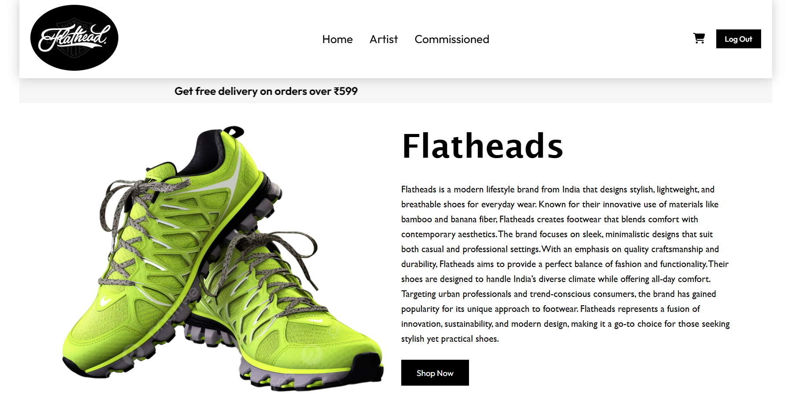
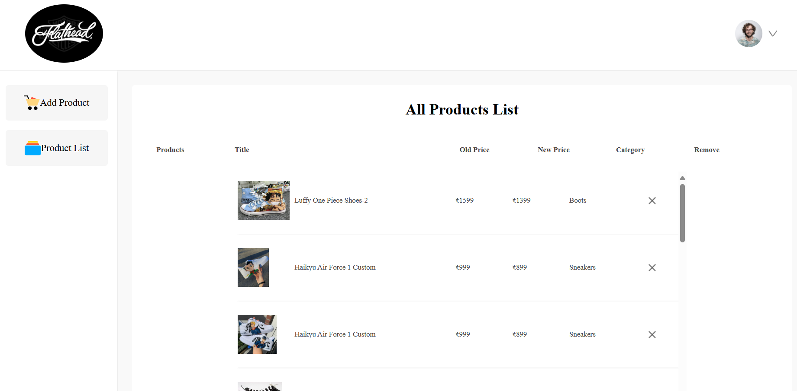
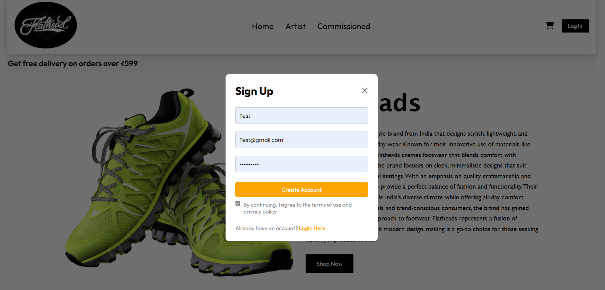
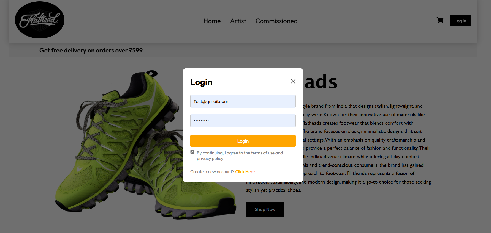
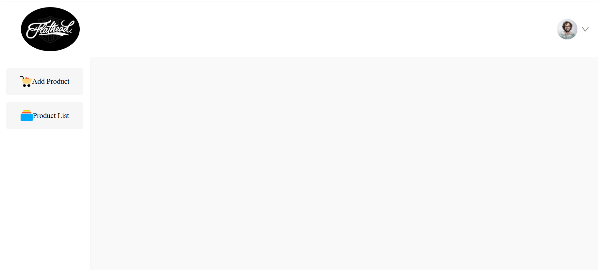
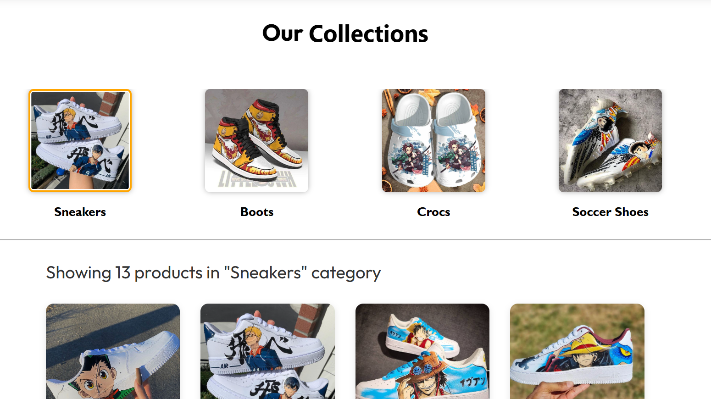
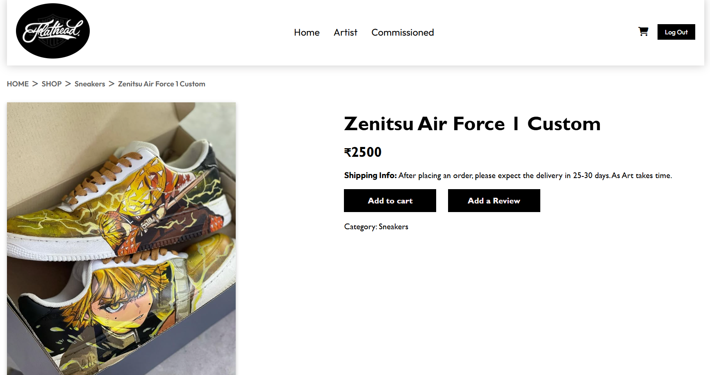
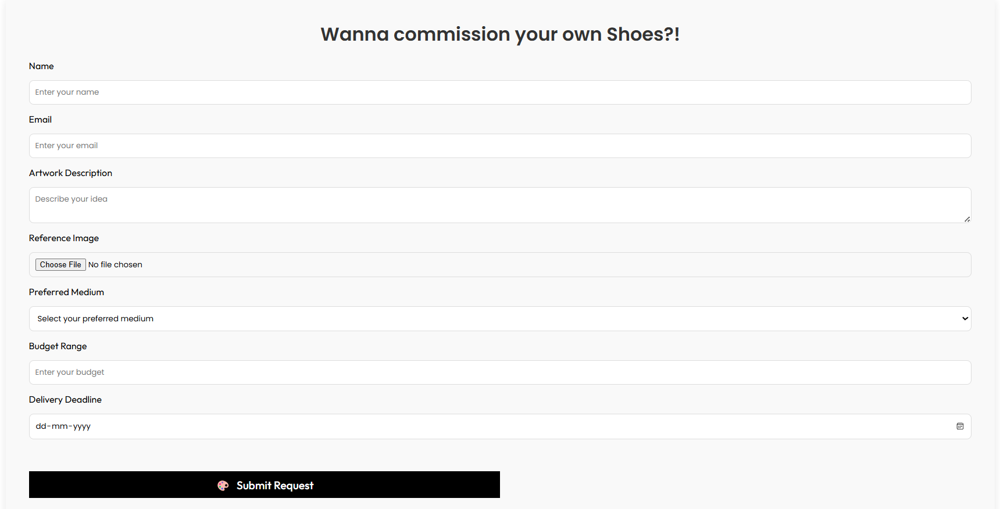
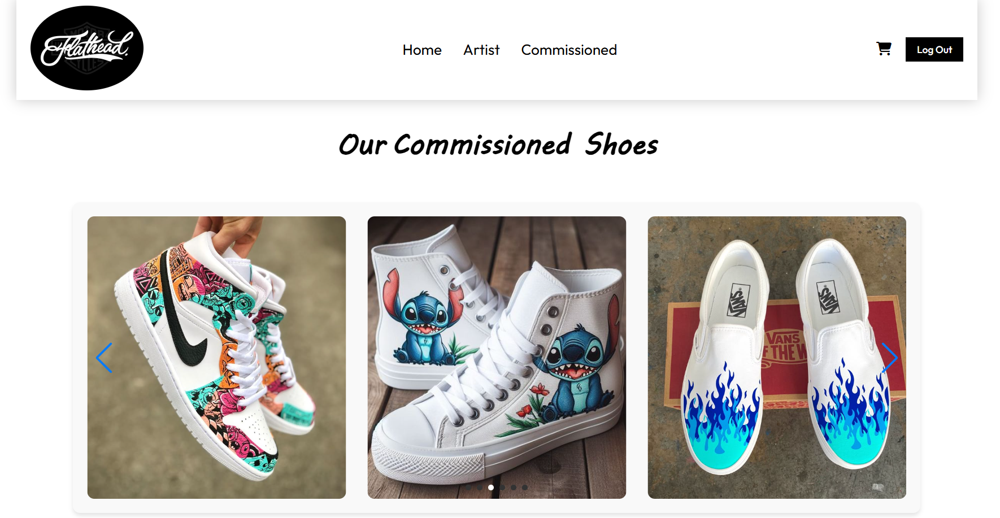

# 👟 Flatheads - Full Stack E-commerce Shoe Store

Flatheads is a modern and responsive full-stack e-commerce web application built using the **MERN stack** (MongoDB, Express, React, Node.js). It allows users to browse and buy custom-designed shoes, while the admin can manage products and orders via a dedicated admin panel.

🔗 **Live Demo:** https://flatheads-frontend.onrender.com

---

## ✨ Features

### 👥 User Features
- 🛍 Browse shoes by categories and filters
- ➕ Add items to cart and wishlist
- 🔐 Secure login/signup with JWT-based auth
- 💳 Razorpay integrated checkout system
- ⭐ Product reviews and star ratings
- 🎨 Customization
- 📩 Receive confirmation email on your registered gmail

### 🛠 Admin Features
- 📦 Add, update, delete products
- 📊 Manage all orders and shipping status
- 👤 View all users and their orders
- ☁️ Upload product images via Cloudinary

---

## 🧱 Tech Stack

| Frontend        | Backend           | Database     | Other Tools           |
|-----------------|-------------------|--------------|------------------------|
| React.js        | Node.js + Express | MongoDB      | Cloudinary (Images)   |
|  CSS            | JWT Auth          | Mongoose     | Razorpay (Payments)   |
| React Router    | REST API          |              | Render (Deployment)   |

---

## 📸 Screenshots

| Home Page | About Us | Cart Page |
|-----------|----------|-----------|
|  |  |  |

| New Arrivals | Product List | Sign Up |
|--------------|--------------|---------|
|  |  |  |

| Login | Admin Panel | Collections |
|-------|-------------|-------------|
|  |  |  |

| Custom Requests | Commission Request | Commissioned Artwork |
|-----------------|--------------------|-----------------------|
|  |  |  |

---

## 🚀 Getting Started (Local Setup)

Follow these steps to run the project on your local machine:

### 1. Clone the repository

git clone https://github.com/SHRAVANIRANE/MERN-E-commerce.git

### 2. Setup the backend
<pre>
cd backend
npm install
</pre>

Create a `.env` file inside the `backend/` folder and add:

MONGO_URL=your_mongodb_connection_string
JWT_SECRET=your_jwt_secret
RAZORPAY_KEY_ID=your_razorpay_key
RAZORPAY_SECRET_KEY=your_razorpay_secret

Run the backend server:
node index.js

### 3. Setup the frontend

Open a new terminal:
<pre>
cd frontend
npm install
npm run dev
</pre>
---

## 🛒 Folder Structure

<pre>
Flatheads/
├── frontend/
│ ├── public/
│ └── src/
│ ├── components/
│ ├── pages/
│ ├── App.jsx
│ └── main.jsx
├── backend/
│ ├── controllers/
│ ├── models/
│ ├── routes/
│ ├── uploads/images/
│ └── index.js
├── screenshots/
├── README.md
</pre>

---

## ☁️ Deployment Steps (Render)

### 🔧 Backend Deployment

1. Go to [Render](https://render.com/)
2. Create a new Web Service
3. Connect your GitHub repo
4. Set root directory to `backend/`
5. Add environment variables from your `.env` file
6. **Build Command:** `npm install`
7. **Start Command:** `npm run dev`

### 🎨 Frontend Deployment

1. Create another Web Service or Static Site
2. Set root directory to `frontend/`
3. **Build Command:** `npm install && npm run build`
4. Set `dist/` as the publish directory

---

## 🙋‍♀️ Author

**Shravani Santosh Rane**  
Computer Science Graduate | Full Stack Developer

- 🌐 Portfolio: *Coming Soon*
- 💼 [LinkedIn] https://www.linkedin.com/in/shravaniirane2122/
- 💻 [GitHub] https://github.com/SHRAVANIRANE
---

## ✨ Support

If you liked the project, don't forget to ⭐ star the repo!

---

## 📄 License

This project is open source and available under the [MIT License](LICENSE).
